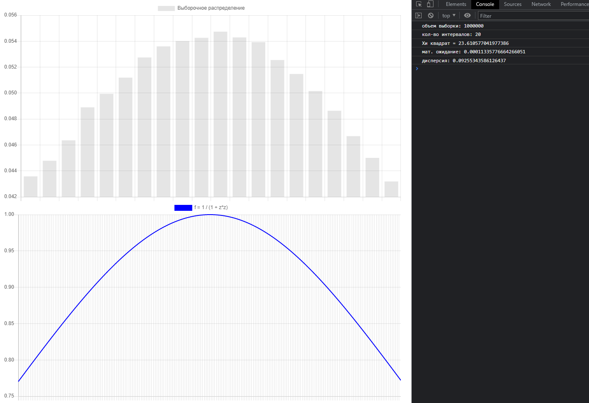

# Построение генератора случайных чисел с заданным законом распределения

## Задание
В соответствии с индивидуальным вариантом задания:  
1. Построить программный генератор случайных чисел с заданным законом распределения.
Рекомендуется использовать метод обратных функций.
2. Оценить величину математического ожидания и дисперсии по выборкам объемом 
50, 100, 1000, 10000 и сравнить с точными величинами, полученными аналитически.
3. Оценить соответствие полученного закона заданному, используя критерий 
согласия Пирсона

При выполнении п. 3 предусмотреть:
- построение гистограммы;
- использование выборок, указанных в п. 2 объемов.

Исходные данные:
- Плотность распределения вероятностей: f(z)=1/(1+z^2)
- Интервал распределения (-tan(0.5) ≤ z ≤ tan(0.5))

## Результат
Сгенерированные числа были получены с помощью метода обратных функций  
Первый график - гистограмма для статистического ряда (ВЫБОРКА)  
Второй график - график функции f(z)=1/(1+z^2)
